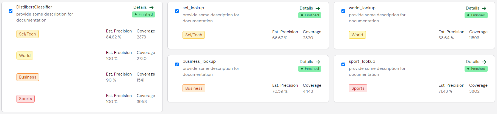
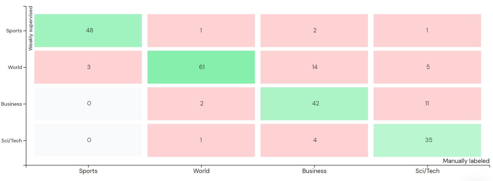
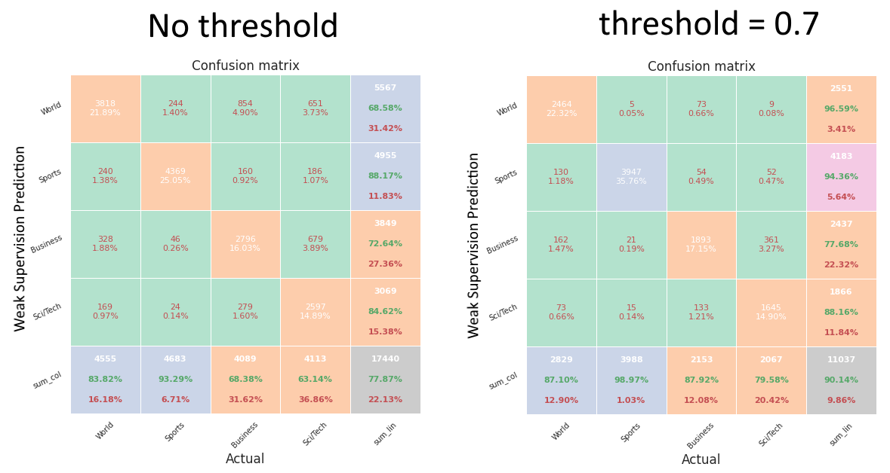

[](https://github.com/code-kern-ai/refinery-sample-projects)

# 🧮 Finetuning similarity search
In this use case, we show you how to fine-tune embeddings on your own data for better similarity search using [Kern *refinery*](https://github.com/code-kern-ai/refinery) and [Quaterion](https://github.com/qdrant/quaterion).


## Data
We use a publicly available dataset for demonstration purposes, namely the [AG News Classification Dataset from Kaggle](https://www.kaggle.com/datasets/amananandrai/ag-news-classification-dataset). The data is already labeled, which is not a problem for this sample project as it can help us assess the quality of our labeling (or we could find labeling mistakes in the original data 😉). We also limit ourselves to 20.000 records for faster processing.

## Project settings
We have English text, so we use the English tokenizer `en_core_web_sm`. For the generation of embeddings we just use `distilbert-base-uncased` from [🤗 Hugging Face](https://huggingface.co/distilbert-base-uncased).

## Labels
The goal  is to classify the shortened news article into one of four categories:
- World
- Sports
- Business
- Sci/Tech

These categories therefore represent our four possible labels for the classification labeling task `Topic`.
The additional two information extraction labeling tasks `Title Topic` and `Description Topic` help us in building an understanding of what contributed to our labeling decision. They also automatically build up the lookup lists that we will use for our heuristics later.

## `Topic` heuristics
The most trivial heuristics we can use are keyword lookups, one for each label. One could also merge them into a single labeling function, but that would make it harder to validate and debug.

Take a look at the example of `sport_lookup`:
```python
from knowledge import sports # this is how to use lookup lists inside the kern refinery
# sports =  ["games", "final", "injury", "medal", "olympics", ...]

def sport_lookup(record):
    for term in sports:
        if(term.lower() in record["Title"].text.lower()):
            return "Sports"
        elif(term.lower() in record["Description"].text.lower()):
            return "Sports"
```

We also registered an Active Learner called `DistilbertClassifier`:
```python
from sklearn.linear_model import LogisticRegression

class DistilbertClassifier(LearningClassifier):

    def __init__(self):
        self.model = LogisticRegression()

    @params_fit(
        embedding_name = "Description-classification-distilbert-base-uncased",
        train_test_split = 0.5 # we currently have this fixed, but you'll soon be able to specify this individually!
    )
    def fit(self, embeddings, labels):
        self.model.fit(embeddings, labels)

    @params_inference(
        min_confidence = 0.8,
        label_names = None # you can specify a list to filter the predictions (e.g. ["label-a", "label-b"])
    )
    def predict_proba(self, embeddings):
        return self.model.predict_proba(embeddings)
```

Here we use the `Description-classification-distilbert-base-uncased` because we suspect the description to hold more valuable information than the title. The cleanest way would probably be to use the embedding of a proxy attribute where title and description are concatenated, but for the sake of simplicity, we are keeping it at the description only. 

We end up with the following heuristics:
<p align="center">
    
</p>

## Labeling workflow and weak supervision
The labeling workflow is rarely linear and more often an iterative process of labeling, writing heuristics, validating heuristics, re-labeling, applying weak supervision, validating the results, and much more.

In this example, we first labeled around 250 records to get a feeling for the data and build up the lookup lists. After that, we added the heuristics, namely the lookup functions and the active learner. We then validated the heuristics in the data browser by inspecting conflicts and removing confusing keywords from the respective lookup lists. Once we were relatively satisfied with the results, we ran the weak supervision and looked at the confusion matrix.

<p align="center">
    
</p>

For this end-to-end use case, we are satisfied with the accuracy and can advance to the next step towards our fine-tuned similarity search.

## Data Export and Quaterion format
### Export
We could use the in-app functionality of exporting our data, but we wouldn't be developers if we weren't committed to eliminating every second of manual labor 😉. That is why we will export it using the [refinery SDK](https://github.com/code-kern-ai/refinery-python), which can be easily installed with pip.

```
$ pip install python-refinery
```

After that, we can simply fetch our data using the following code:
```python
from refinery import Client

# if you don't want these in your code, please visit the refinery sdk repo 
user_name = "your-username"
password = "your-password"
project_id = "your-project-id" # can be found in the URL of the web application

# if you run the application locally, use "http://localhost:4455" as the uri
client = Client(user_name, password, project_id, uri="https://app.kern.ai/")

df = client.get_record_export(tokenize=False)
```

Before we continue with Quaterion, we must have to select the data that is labeled to our specifications, namely either have a manual label or weakly supervised label with a confidence above `0.7` (you can use any other threshold, of course. See below why we decided to go for `0.7`):
```python 
filtered_df = df[
    (df["__Topic__WEAK_SUPERVISION__confidence"].astype(float) > 0.7) # threshold check
    & ~(df["__Topic__WEAK_SUPERVISION"].isnull() & df["__Topic__MANUAL"].isnull()) # either manually or weakly labeled
    ].reset_index()
```

Now, we add a new column that is either the manual label or, if there is none, the weakly supervised label:
```python 
def combine_labels(row):
    if(row["__Topic__MANUAL"] is not None):
        return row["__Topic__MANUAL"]
    else:
        return row["__Topic__WEAK_SUPERVISION"]

filtered_df["label"] = filtered_df.apply(combine_labels, axis=1)
```

To finish the pre-processing, we just split this into a train and validation set and save them as a json for Quaterion later.
```python
filtered_df_val = filtered_df[["Title", "Description", "label"]].iloc[-2500:]
filtered_df_train = filtered_df[["Title", "Description", "label"]].iloc[:-2500]

filtered_df_val[["Title", "Description", "label"]].to_json("labeled_data_val.json", orient="records")
filtered_df_train[["Title", "Description", "label"]].to_json("labeled_data_train.json", orient="records")
```
## Quaterion
```
$ pip install quaterion
```

For fine-tuning similarity with classification data, we will use `SimilarityGroupSample` objects (see [quaterion quick start](https://quaterion.qdrant.tech/getting_started/quick_start.html#similarity-groups)).

```python
from quaterion.dataset.similarity_data_loader import (
    GroupSimilarityDataLoader,
    SimilarityGroupSample,
)

class JsonDataset(Dataset):
    def __init__(self, path: str):
        super().__init__()
        with open(path, "r") as f:
            self.data = [json.loads(line) for line in f.readlines()]

    def __getitem__(self, index: int) -> SimilarityGroupSample:
        item = self.data[index]
        return SimilarityGroupSample(obj=item, group=hash(item["label"]))

    def __len__(self) -> int:
        return len(self.data)

train_dataloader = GroupSimilarityDataLoader(JsonDataset('./labeled_data_train.json'), batch_size=128)
val_dataloader = GroupSimilarityDataLoader(JsonDataset('./labeled_data_val.json'), batch_size=128)
```

The data is now prepared to be processed in a Quaterion fine-tuning pipeline!

## Notes
### Weak supervision threshold
The exported data contains not only the label that was assigned by weak supervision but also the confidence attached to it. Selecting the right threshold (when to take the weak supervision label as the real label) is always difficult and a trade-off between accuracy and amount of labeled data.

After inspecting several threshold levels, we settled with 0.7:
<p align="center">
    
</p>

If you're wondering how these plots were generated, head over to the [pretty-print-confusion-matrix GitHub repo](https://github.com/wcipriano/pretty-print-confusion-matrix)!